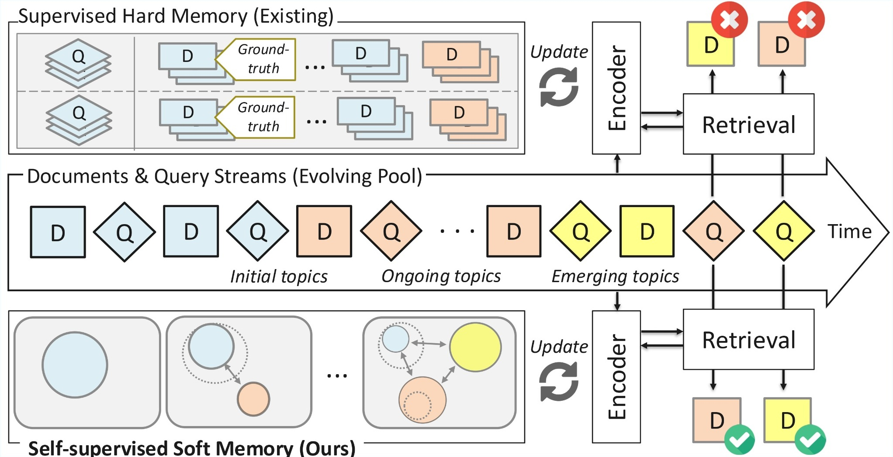
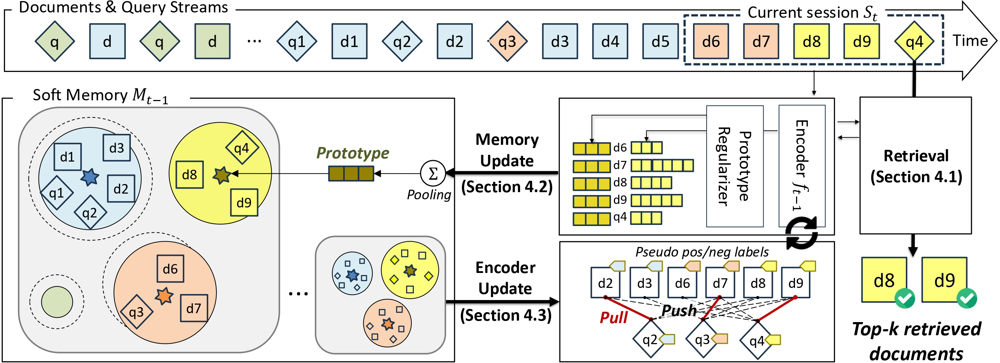

<div align="center">

# CREAM: Continual Retrieval on Dynamic Streaming Corpora with Adaptive Soft Memory 
  
[](https://arxiv.org/pdf/2601.02708)

</div>

Official implementation of **CREAM**, a self-supervised framework for **memory-based continual retrieval** on dynamic streaming corpora.  
CREAM learns continual retrieval **in a fully unsupervised setting** with **adaptive soft memory**. 

<p align="center">
  <a href="assets/motivation.jpg">
    
  </a>
</p>

### TL;DR
CREAM proposes **soft memory** for practical continual IR under **unbounded / unlabeled / topic-shifting** streaming corpora, and introduces three key techniques:  
1) **Fine-grained similarity** (token-level semantics) 
2) **Regularized cluster prototypes** (fixed token length prototypes via LSH-style regularization) 
3) **Stratified coreset sampling** (diverse training samples from memory)  

### Method Overview
CREAM repeats three stages per streaming session:  
- **Retrieval**: return relevant documents with the up-to-date encoder  
- **Memory Update**: streaming clustering with regularized prototypes (soft memory maintenance)  
- **Encoder Update**: self-supervised training via contrastive objective using pseudo pos/neg sampled from memory   



### Datasets
- LoTTE
  - https://huggingface.co/datasets/colbertv2/lotte
  - https://huggingface.co/datasets/colbertv2/lotte_passages
- MSMARCO
  - https://github.com/naver/ms-marco-shift

# Quick Start
1) Generate sessions(cream/src/data)
```
# Raw sessions
python generate_multi_test.py

# Filtering with BM25
python proposal_input_helper.py
```
2) Train and evaluate(cream/src)
- You can evaluate with rolling evaluation optionally.
```
python main.py \
 --exp=proposal_qq_low \
 --use_tensor_key \
 --warming_up_method=stream_seed \
 --sspq=50 \
 --start=0 \
 --end=10 \
 --rdsz=50 \
 --cmnsz=50 \
 --mi=3 \
 --init_k=5 \
 --light_weight \
 --light_weight_rate=0.25
```

# Citation
```bibtex
@inproceedings{son2026cream,
  title     = {CREAM: Continual Retrieval on Dynamic Streaming Corpora with Adaptive Soft Memory},
  author    = {Son, HuiJeong and Kang, Hyeongu and Kim, Sunho and Ho, Subeen and Kang, SeongKu and Lee, Dongha and Yoon, Susik},
  booktitle = {Proceedings of the ACM SIGKDD International Conference on Knowledge Discovery and Data Mining (KDD '26)},
  year      = {2026}
}
```

